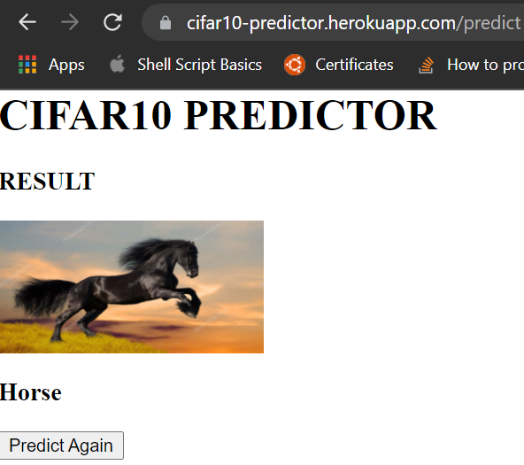

## Session 2 Assignment - Team Submission
Team Members
1. S.A.Ezhirko
2. Naga Pavan Kumar Kalepu

### Session 2 is about implementing and understanding Flask, PyTorch and Heroku
**Got Good understanding on** :  
* RESNET18
* Classes in CIFAR10 Dataset
* Flask Framework
* HTML, Javascript and CSS
* JSON format
* Heroku deployment

### Session 2 Assignment Execution
* Implemented RESNET18 CNN network using PyTorch. The resnet model file can be found [here](https://github.com/emlo1convergence/emlo1/blob/main/Session2_Assignment/Ezhirko/resnet.py)
* Trained it on local machine for 15 epoch and got an accuracy for 78 %. The notebook file used for training can be found [here](https://github.com/emlo1convergence/emlo1/blob/main/Session2_Assignment/Ezhirko/cifar_train.py)
* Created a utility file and added a method to convert a image into tensor and method that calls the model and predicts the class of the image. The utility file can be found here [Ezhirko Version](https://github.com/emlo1convergence/emlo1/blob/main/Session2_Assignment/Ezhirko/app/torch_utils.py) and [Pavan Version](https://github.com/emlo1convergence/emlo1/blob/main/Session2_Assignment/Pavan/app/torch_utils.py)
* Created a Web based User interface using HTML.The file can be found here [Ezhirko Version](https://github.com/emlo1convergence/emlo1/blob/main/Session2_Assignment/Ezhirko/app/templates/ObjectPredictorUI.html) and [Pavan Version](https://github.com/emlo1convergence/emlo1/blob/main/Session2_Assignment/Pavan/app/templates/index.html). The user can select an image and choose to predict to know the class that model determines. The HTML file makes use of javascript to execute client side functions for certain operations. The javascript file can be found here [Ezhirko version](https://github.com/emlo1convergence/emlo1/blob/main/Session2_Assignment/Ezhirko/app/static/scripts/index.js)
* Created a main app file which uses flask. The methods are written to execute based on PUSH action from the client side. The main app file loads the HTML web page and gets uploaded image to analyse. The main.py [Ezhirko version](https://github.com/emlo1convergence/emlo1/blob/main/Session2_Assignment/Ezhirko/app/main.py) and [Pavan Version](https://github.com/emlo1convergence/emlo1/blob/main/Session2_Assignment/Pavan/app/main.py)
* Python Runtime version and other packages installed were captured to [runtime.txt](https://github.com/emlo1convergence/emlo1/blob/main/Session2_Assignment/Ezhirko/runtime.txt) and [requirement.txt](https://github.com/emlo1convergence/emlo1/blob/main/Session2_Assignment/Ezhirko/requirements.txt)
* To host on Heroku server [Procfile](https://github.com/emlo1convergence/emlo1/blob/main/Session2_Assignment/Ezhirko/Procfile) is create and [wsgi.py](https://github.com/emlo1convergence/emlo1/blob/main/Session2_Assignment/Ezhirko/wsgi.py) is created to specify the main application file.
* Created Heroku account, created app name "object-predict" (Ezhirko Version) and "" (Pavan Version)
* Deployed the app to Heroku. [Ezhirko link](https://object-predict.herokuapp.com/) and [Pavan link](https://cifar10-predictor.herokuapp.com/)

### How to use Ezhriko's object-predict application ?
* Goto web [link](https://object-predict.herokuapp.com/). The web page should look like below  

* Click on open button and select a image from your system that could belong to any of the classes in CIFAR10 dataset.  

* Click on "Predict object" button. The Image is passed on to the model and the model predicts to which class it belongs. The prediction response is sent back to web page showing the result as below.  

* Click on "Close" button to close the existing image.

### How to use Pavan's CIFAR10 Predictor application ?
* Goto web [link](https://cifar10-predictor.herokuapp.com/). The web page should look like below  

* Click on open button and select a image from your system that could belong to any of the classes in CIFAR10 dataset.  

* Click on "Predict object" button. The Image is passed on to the model and the model predicts to which class it belongs. The prediction response is sent back to web page showing the result as below.  

* Click on "Predict Again" button to predict once again.

**Ezhirko Repository** : https://github.com/emlo1convergence/emlo1/tree/main/Session2_Assignment/Ezhirko  
**Pavan Repository** : https://github.com/emlo1convergence/emlo1/tree/main/Session2_Assignment/Pavan
