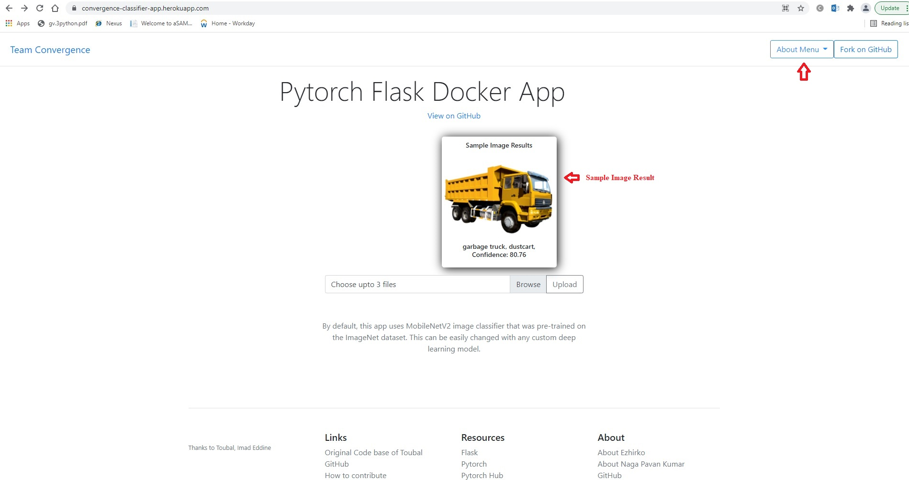
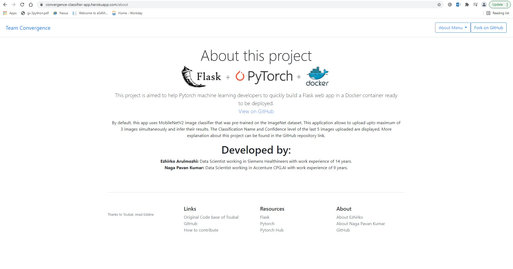
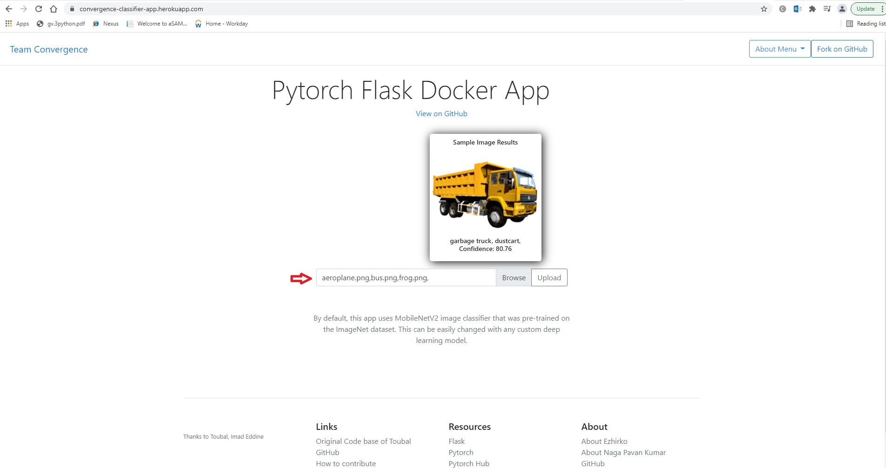
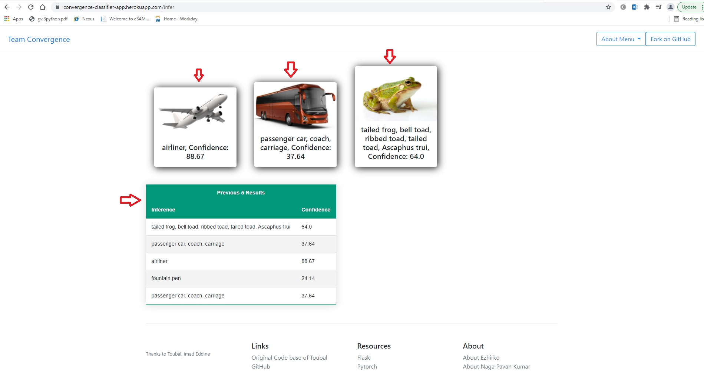
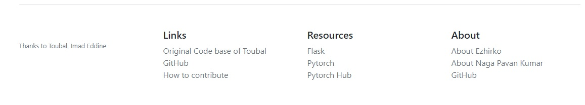

## Session 3 Assignment - Team Submission
Team Members
1. S.A.Ezhirko
2. Naga Pavan Kumar Kalepu

### Session 3 is about implementing and understanding Flask, Docker and Heroku
**Got Good understanding on** :  
* Flask Framework
* HTML, Javascript and CSS
* Containerization and Docker
* Deploying Docker image on Heroku

### Session 3 Assignment Execution
* Installed Docker for windows from [here](https://docs.docker.com/desktop/windows/install/)
* Made use of [exiting code](https://github.com/imadtoubal/Pytorch-Flask-Starter) provided by author Imad Toubal
* Ran his application by creating a docker image based out of python 3
* Modified the User interface to display a default sample image with his infered output from mobile net model. This was done by adding a Entrypoint and Command to docker file and passing a sample image for the model to infer. Link to our [docker file](https://github.com/emlo1convergence/emlo1/blob/main/Session3_Assignment/Dockerfile)
* The application has be modified to take in 3 images simultaneously and pass on to the mobile net model. The predicted output (The class name and confidence score) is shown along with the uploaded images in the inference page. Here is [inference code](https://github.com/emlo1convergence/emlo1/blob/main/Session3_Assignment/app.py) and [Inference HTML](https://github.com/emlo1convergence/emlo1/blob/main/Session3_Assignment/templates/inference.html)
* The result of the prediction is saved to a csv file on the storage. The last 5 prediction are retrived from this [csv file](https://github.com/emlo1convergence/emlo1/blob/main/Session3_Assignment/static/uploads/prev_result.csv) and displayed on the inference page.
* The Main page contains a dropdown that displays our team and project information and option to return back to main page. Here is [About HTML](https://github.com/emlo1convergence/emlo1/blob/main/Session3_Assignment/templates/about.html)
* The modified code is containerized on Python 3 docker image and deployed on Heroku. Below are the steps to deploy on Heroky
  -heroku container:login
  -heroku create ABC
  -heroku container:push web -a ABC
  -heroku container:release web -a  ABC
  where ABC is the name your application. Access the app through the url https//ABC.herokuapp.com/
### How to use convergence classifier application ?
* Goto web [link](https://convergence-classifier-app.herokuapp.com/). The web page should look like below  

  - Main page displays Sample image with its infered results.
  - Browse button to choose upto 3 images to infer.
  - About menu to know about our team and project.
 * Click on About Menu and choose "Project and Team" to know about this project and people who developed this application. 
 
 * Click on About Menu and choose "Main Page" to return to main page.
 * Click on "Browse" button and select upto 3 images. The text box displays the name of selected images.
 
 * Click on Upload button. The result page displays the images that we uploaded with their inference and confidence score below each image. This page also shows previously uploaded 5 images and its result
 
 * Click on About Menu and choose "Main Page" to return to main page.
 * The links section provided the links to 
  - Original code based of the author
  - Resource to Flask, pytorch and pytorch Hub
  - About the developers of the application and link to this application git repository
 
 
**Our Repository** : https://github.com/emlo1convergence/emlo1/tree/main/Session3_Assignment  
  
